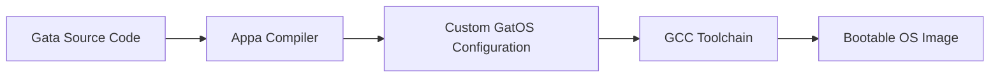

<p align="center">
  
</p>

<h1 align="center">The Gata Programming Language</h1>

<p align="center">
  <a href="#license"></a>
  
  
  
  
</p>

Gata is a statically typed systems language whose compiler produces a **bootable operating system image** instead of an executable. It is also part of my undergraduate thesis at the [University of Macedonia](https://www.uom.gr/en/dai), and is the frontent of the OS building toolchain called PawStack.

This repository is the **home of the language**, not of the compiler. It holds the standard library, the book, the environment files, the editor tooling and the examples. The compiler that reads all of it lives in [the Appa repository](https://github.com/ApparentlyPlus/Appa).

> [!IMPORTANT]
> **You cannot write Gata without `appa`.** There is no interpreter and no standalone build here; nothing in this repository compiles on its own. Install the compiler first, either by following [Chapter 1 of the book](docs/The%20Gata%20Programming%20Language.md) or the [Getting Started section of the Appa repo](https://github.com/ApparentlyPlus/Appa#getting-started). `appa install` then pulls `libgata` and the environment files down from here for you, so a normal user never has to clone this repository at all.

The first section of this README focuses on providing some insight as to the vision of this project. If you'd rather skip the philosophy, the tour of what's actually in here starts at [What's in This Repository](#whats-in-this-repository).

## Table of Contents

- [Project Overview & Background](#project-overview--background)
- [What's in This Repository](#whats-in-this-repository)
- [What's *not* in This Repository](#whats-not-in-this-repository)
- [Getting Started](#getting-started)
- [The Standard Library](#the-standard-library)
- [Documentation](#documentation)
- [Editor Support](#editor-support)
- [Environments](#environments)
- [Examples](#examples)
- [Development](#development)
- [Contributing](#contributing)
- [License](#license)
- [Acknowledgments](#acknowledgments)
- [So... what now?](#so-what-now)


## Project Overview & Background

### What is PawStack?

"PawStack" is just the name I decided to use for a development toolchain that aims to drastically simplify OS development. It allows you to write code just like you would for a regular program — but instead of compiling to an application, your code is compiled directly into a complete, bootable operating system image.

This means your program ***is*** the operating system.

PawStack handles the complex parts of turning your code into low-level machine instructions that run on real hardware or emulators. The goal is to let you focus on building your OS's features without worrying about the usual technical challenges involved in OS development.

The whole toolchain is comprised of 3 components:

| Component | Description | Status |
|-----------|-------------|--------|
| **[GatOS](https://github.com/ApparentlyPlus/GatOS)** | A modular kernel forming the core of PawStack, exposing APIs and syscalls for core OS functionality. | **Feature Complete** |
| **Gata** | The current project. A custom high-level programming language for writing operating systems. It *feels* like a modern language, but is built with features that make low-level development simpler and more approachable. | **Feature Complete** |
| **[Appa](https://github.com/ApparentlyPlus/Appa)** | The compiler for Gata. It takes in Gata source code and transpiles it into C code that calls GatOS's APIs, constructing the kernel based on the code's logic by leveraging the modularity of GatOS's design. | **Feature Complete** |

### Build Pipeline



Gata is the `A`. Everything in this repository is either the language you write there, or something that helps you write it.

### What the language is like

Gata is meant to feel like a language you already know. Classes, generics, tagged unions, operator overloading, real error handling, automatic memory management: all the things I kept wanting while writing kernel C and could not have.

What it does *not* do is quietly hand you things a kernel cannot pay for. There is no garbage collector, no exceptions unwinding through arbitrary frames, no hidden virtual dispatch, and nothing allocating behind your back. Every convenience in the language had to survive the question *"can this run at boot, on a machine with no operating system underneath it?"*

```gata
import Console;

realm kernel {
    entry func Main() {
        Console.PrintLine("Hello from the kernel!");
    }
}
```

That is a complete operating system. Compile it with `appa build` and you get an ISO.

### What's with these names?

Glad you asked! Here's the story behind them:

**GatOS** is a playful pun on the Greek word *gatos* (meaning "male cat"), with the "OS" tacked on for "Operating System". It was inspired by a similar, more educationally focused project called [Skyl-OS](https://github.com/Billyzeim/Skyl-OS) — another pun, this time on *skylos* (meaning "male dog") — created by a close friend of mine.

Following the same "cat" theme, I named the high-level language of the toolchain "**Gata**" — Greek for "female cat." It felt like the perfect fit for the language developers will use to interact with the toolchain, write code, and build their projects.

Finally, the compiler in the toolchain is called **Appa**. The name is inspired from the flying bison in Nickelodeon's animated series *"Avatar: The Last Airbender"*, a loyal companion to the main cast. The "bison" part is intentional — it's a direct nod to [GNU Bison](https://github.com/akimd/bison), the well-known syntax analysis tool used in building compilers.

"**PawStack**" is just a blend of comp-sci lingo and the animal based naming convention — perfect name for describing the entire toolchain ;)

### What is your university thesis on?

In short, my thesis focuses on developing a functional demo of the PawStack toolchain and thoroughly documenting its inner workings.

When I began, I had zero prior experience in OS development. Because of that, I see this as a great opportunity not only to deliver the demo, but also to create concise write-ups detailing my journey — what steps I took, the mistakes I made, what I omitted, what could be improved, and the features I implemented.

The end goal is for this to serve as a helpful reference in a field where accessible, beginner-friendly resources are scarce.

### Are you crazy?

Yes.


## What's in This Repository

This repo exists to maintain the things that make up Gata *as a language*, separately from the compiler that implements it. Five things live here:

| Directory | What it holds |
|---|---|
| **[`libgata/`](libgata/)** | The standard library. 24 modules, roughly 6,900 lines, written in ordinary Gata with no privileges the language itself does not have. |
| **[`docs/`](docs/)** | [The Gata Programming Language](docs/The%20Gata%20Programming%20Language.md) — the book — plus the [Gata Quick Reference](docs/Gata%20Quick%20Reference.txt) and the [Libgata Reference](docs/Libgata%20Reference.md), the standard library's manual pages. |
| **[`envs/`](envs/)** | The environment files: the binding layer between Gata and whatever sits underneath it, one per target. |
| **[`editors/vscode/`](editors/vscode/)** | The VS Code extension: syntax and semantic highlighting, live diagnostics, hovers, outline and completion. |
| **[`examples/`](examples/)** | Complete example projects and standalone snippets. |

Everything here is consumed by `appa`. `appa install` downloads `libgata/` and `envs/` and puts them where the compiler expects them; `appa new` scaffolds a project around them. That is the intended relationship: you install the compiler, and this repository comes along for the ride.

The reason to clone it directly is if you want to read the library sources, build the editor extension from a checkout, or work on the language itself.


## What's *not* in This Repository

Better you hear it from me now than go looking:

| Not here | Where it is instead |
|---|---|
| **The compiler** | [Appa](https://github.com/ApparentlyPlus/Appa). Lexer, parser, type resolver, capability inference, C backend — all of it. This repo has no build step and no binary to produce. |
| **The kernel** | [GatOS](https://github.com/ApparentlyPlus/GatOS). `libgata` calls into it through `envs/env.GatOS.g`, but it does not vendor a line of it. |
| **Networking and a filesystem** | Nowhere, and that is structural rather than an oversight. GatOS implements neither, so no amount of library code in `libgata` could add them. [Chapter 21](docs/The%20Gata%20Programming%20Language.md) explains exactly why a library cannot paper over a missing kernel capability. |
| **A language server protocol implementation for other editors** | Only VS Code is supported. The server under `editors/vscode/server/` is a port of Appa's own lexer and parser, and is wired to the VS Code client specifically. |


## Getting Started

**Writing Gata requires `appa`.** Install it first, then come back:

```bash
# Grab appa for your platform from the Appa releases page, then:
appa install              # fetches the toolchain, libgata and the envs from this repo
appa new myos && cd myos  # scaffold a project
appa run                  # build it and boot it in QEMU
```

The full walkthrough is [Chapter 1 of the book](docs/The%20Gata%20Programming%20Language.md), and the compiler's own instructions are in the [Appa README](https://github.com/ApparentlyPlus/Appa#getting-started). Either is enough; the book has more context, the Appa README has more command detail.

`appa new` gives you three files:

```
myos/
├── myos.gconf     Project configuration
├── env.g          The environment (copied from envs/, see below)
└── src/main.g     Your program
```

> [!TIP]
> If you just want to read Gata rather than run it, you need nothing installed at all. The book and the [examples](#examples) are plain text, and every code sample in the book is compiled by Appa's test suite, so what you read is what compiles.


## The Standard Library

`libgata` is imported a module at a time. There is no umbrella import — a module you never name is never parsed and never compiled in.

```gata
import Console;
import List;
```

| | | | |
|---|---|---|---|
| [`Algorithms`](libgata/Algorithms.g) | [`BigInt`](libgata/BigInt.g) | [`Char`](libgata/Char.g) | [`Console`](libgata/Console.g) |
| [`Format`](libgata/Format.g) | [`Hash`](libgata/Hash.g) | [`Int`](libgata/Int.g) | [`List`](libgata/List.g) |
| [`Long`](libgata/Long.g) | [`Map`](libgata/Map.g) | [`Math`](libgata/Math.g) | [`Mem`](libgata/Mem.g) |
| [`Misc`](libgata/Misc.g) | [`Optional`](libgata/Optional.g) | [`PriorityQueue`](libgata/PriorityQueue.g) | [`Queue`](libgata/Queue.g) |
| [`Random`](libgata/Random.g) | [`Runtime`](libgata/Runtime.g) | [`Set`](libgata/Set.g) | [`Stack`](libgata/Stack.g) |
| [`String`](libgata/String.g) | [`Sync`](libgata/Sync.g) | [`Sys`](libgata/Sys.g) | [`Time`](libgata/Time.g) |

Every one of them is ordinary Gata, written with the features documented in the book. That is deliberate: the standard library has no special access, so anything it can do, your own code can do too.

Full signatures, return values and error conditions are in the [Libgata Reference](docs/Libgata%20Reference.md), written as manual pages — one per module, with the usual NAME, SYNOPSIS, DESCRIPTION, RETURN VALUE and ERRORS sections. Look up a call there; learn the language in the book.

> [!NOTE]
> Dead code elimination happens in the compiler, not here. You import `List` and use one method, you pay for one method — the rest never reaches the emitted C.


## Documentation

Three documents, and they do different jobs:

| Document | What it is |
|---|---|
| **[The Gata Programming Language](docs/The%20Gata%20Programming%20Language.md)** | The book. Part guided tour, part reference: getting started, the language proper (types, control flow, classes, unions and `match`, generics, operators, text, error handling, `defer`), the systems half (processes and threads, shared state, memory and ownership, `unsafe`, dropping to C, realms, environments), then a reference section with the command list, the full diagnostics table, the grammar, keywords and precedence. It closes with three appendices of complete programs. |
| **[Gata Quick Reference](docs/Gata%20Quick%20Reference.txt)** | Every feature the language has, in 26 numbered sections, with a minimal example for each and the diagnostic code it produces when you get it wrong. Derived from the compiler source rather than from the book, so it is the place to check a rule rather than to learn one. Plain text, greppable, and it ends with a single program exercising most of the language. |
| **[Libgata Reference](docs/Libgata%20Reference.md)** | The standard library as man pages. Section 3 is library calls, section 7 is the overview. |

The book is the thing to read. It explains the reasoning wherever something is missing or behaves differently from the language you came from, because "that seems like an oversight" and "that is load-bearing" look identical from the outside. The quick reference is the thing to keep open next to it once you already know why.

Every code sample in the book is compiled by Appa's test suite, and the quick reference is checked against the compiler itself, so the docs cannot silently rot.


## Editor Support

The [VS Code extension](editors/vscode/) is maintained here, in `editors/vscode/`. It covers `.g` source and `.gconf` project manifests, and it has its own [README](editors/vscode/README.md) with the full details.

| Feature | What it does |
|---|---|
| **Semantic highlighting** | Identifiers are classified from their declaration, not their spelling: a generic parameter is colored as one because it was declared as one, a variant because its union declares it. |
| **Syntax highlighting** | A TextMate grammar covering every token the lexer produces — realms, processes, threads, scope qualifiers, generics, operator declarations, interpolation holes, raw C bodies. |
| **Live syntax diagnostics** | A port of Appa's own lexer and parser runs in process on every keystroke, with the compiler's real codes, messages and help lines. |
| **Real semantic diagnostics** | On open and on save, `appa check` runs over the project and its output becomes squiggles. |
| **Hovers, outline, completion** | Every keyword, annotation and primitive carries an explanation; types, methods, operators, variants, realms and threads appear in the outline. |
| **Themes** | `Gata Canopy` (dark) and `Gata Daylight` (light), both entirely optional. The palette lands as foreground-only defaults over whatever theme you already use. |

Installing the packaged build:

```bash
code --install-extension editors/vscode/gata-highlighting-2.2.0.vsix
```

Building it from a checkout needs **Node 18+**:

```bash
cd editors/vscode
npm install
npm run package
```

> [!NOTE]
> The semantic features need `appa` on your `PATH` — that half of the extension shells out to the real compiler. Highlighting works without it.


## Environments

An **environment** is the binding layer between Gata and the thing that actually does the work underneath: a single file declaring the fixed set of C functions the language sits on (`_env_alloc`, `_env_write`, the clock, the process trio, and so on). `libgata` is written entirely over that floor, which is what keeps it target-independent.

| File | Target |
|---|---|
| [`envs/env.GatOS.g`](envs/env.GatOS.g) | The kernel target. Binds to GatOS's APIs and declares the kernel, user and boot preambles. Output is a bootable ISO. |
| [`envs/env.hosted.g`](envs/env.hosted.g) | The hosted target. Binds to libc, portable across Linux, macOS and Windows. Output is an ordinary program you can run and debug on your own machine. |

`appa new` copies the right one into your project as `env.g`.

> [!WARNING]
> You almost certainly should not edit your project's `env.g`. It is scaffolded for you, and the one legitimate reason to touch it is if you are extending GatOS itself and need to expose a new call.


## Examples

The [`examples/`](examples/) directory holds complete, buildable projects rather than fragments — each one a real `.gconf`, `env.g` and `src/` tree that you can drop into `appa run` as-is. They range from a minimal serial program, through the framebuffer and keyboard paths, to multi-threaded programs that exercise most of the language at once.

```bash
cd examples/<name>
appa run
```

They double as a smoke test: if an example stops building, something in the language or the library moved.


## Development

### Repository Layout

```
libgata/            The standard library, 24 modules of ordinary Gata
docs/               The book, the quick reference and the libgata manual pages
envs/               Environment files, one per target
editors/vscode/     The VS Code extension and its language server
examples/           Complete example projects
```

### Working on the Language

There is nothing to build in this repository. The workflow is:

1. **Edit** the library, the docs, an environment or the extension
2. **Verify with the compiler**: `appa check` over a project that uses what you changed, and `appa run` if it touches runtime behaviour
3. **Run Appa's suite** if the change is to `libgata` or `envs/` — a good part of that suite compiles real Gata programs and boots real ISOs, and it is the only thing that can tell you a library change broke something
4. **Merge**: `next`, then `main`

The `Hosted` backend is the fastest loop for library work. It emits plain C you can compile with your system compiler and run under `gdb`, `valgrind` or a sanitizer build, with no emulator and no boot in the way.

### A Note on Versioning

The language, the library and the compiler move together. `libgata` here always tracks the current `appa`, which is why `appa install` fetches it rather than letting you pin the two independently. If you are building something on top of PawStack, pin the appa version and take the library that comes with it.


## Contributing

Contributions are not open since this is my thesis and thus must be my work alone. I need to be able to demonstrate that I understand every piece of code in this project, which means I have to write it myself.

However, you can still:
- **Report Issues**: If you find bugs or have questions, feel free to open issues
- **Provide Feedback**: Suggestions and feedback are always welcome through issues
- **Follow Along**: Watch the repository if you're interested in seeing how this progresses

The one exception is documentation. Write-ups, clarity fixes and typo corrections in `docs/` *are* open to pull request — and given that the book is the largest thing in this repo, that is not a small exception.

Once the thesis is complete, I might consider opening it up for contributions, but that's a decision for future me.


## License

This project is licensed under a strict custom license that does not allow for replication of the code without explicit consent. I am unsure how this project will be used in the future, so the licensing is restrictive for now.

See the [LICENSE](LICENSE) file for details.

The restrictive nature is partly due to academic requirements and partly because I haven't decided what I want to do with this project long-term. This may change after thesis completion.


## Acknowledgments

- [Crafting Interpreters](https://craftinginterpreters.com/) - The book that made language design feel approachable instead of arcane
- [The OS-Dev Wiki](https://wiki.osdev.org/Expanded_Main_Page) - Indispensable for working out what a language for kernels is and is not allowed to promise
- [GNU Bison](https://github.com/akimd/bison) - The namesake of the compiler, and the reason every compiler course starts with a grammar
- [Skyl-OS](https://github.com/Billyzeim/Skyl-OS) - A fantastic educational OS project from my dear friend, u/Billyzeim, and where the naming started

And of course, a much needed thanks to Mr. Ilias Sakellariou for igniting my interest in compilers and custom languages.
